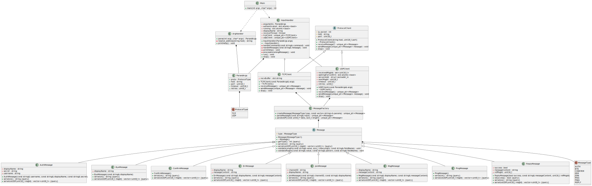
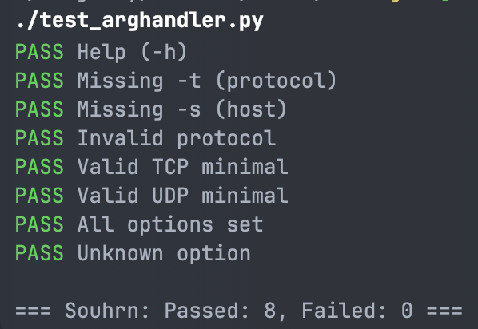
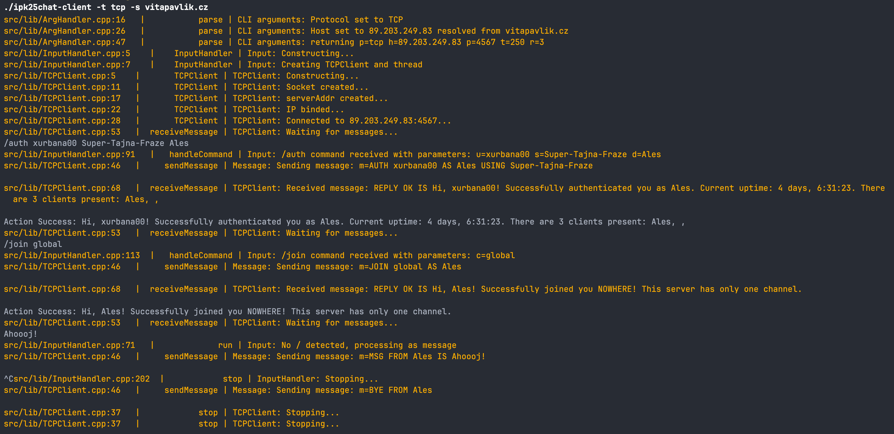
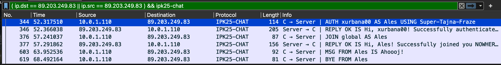
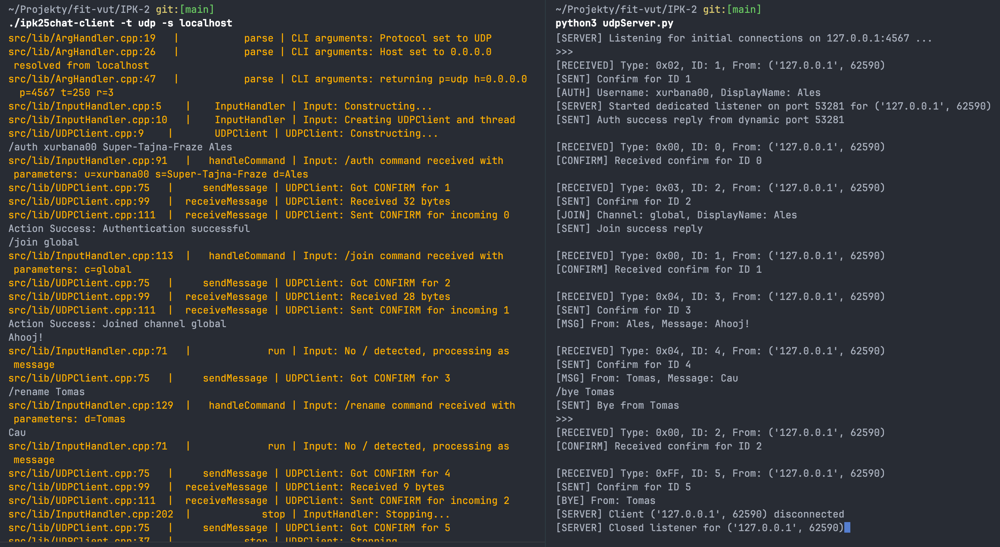

# IPK25 Chat Client

**Name:** Aleš Urbánek  
**Login:** xurbana00

---

## 1. Introduction
This project implements a client application for a chat service supporting both TCP and UDP protocols. The client allows user authentication, message sending and receiving, channel joining, and graceful disconnection.

---

## 2. Theoretical Background (Networking Basics)

### 2.1 Protocol:
In a broader context, a protocol is a set of rules. In networking, it defines data formats and transmission rules.

#### 2.1.1 TCP (Transmission Control Protocol)
Provides reliable and error-checked delivery of packets over the Internet. It ensures data arrives in order and without duplication and manages congestion and flow control.

TCP Connection Establishment & Termination:
1. **Three-Way Handshake (Connection Establishment)** \
   TCP establishes a connection using a three-step handshake:
    1. **SYN:** The client sends a packet with the SYN flag set and an initial sequence number.
    2. **SYN-ACK:** The server responds with SYN-ACK, acknowledging the client’s request and sending its sequence number.
    3. **ACK:** The client sends an ACK, confirming the connection is established.
2. **Four-Step Teardown (Connection Termination)** \
   A TCP connection is terminated using a four-step process:
    1. **FIN:** One side requests to close the connection by sending a FIN.
    2. **ACK:** The other side acknowledges the FIN.
    3. **FIN:** The second side also sends a FIN when ready to close.
    4. **ACK:** The first side acknowledges the second FIN, completing the termination.

#### 2.1.2 UDP: (User Datagram Protocol)
UDP is a **connectionless**, lightweight transport protocol that provides fast data transmission but does not guarantee delivery, order, or error correction.

##### Key Features of UDP
- **No Connection Setup:** Unlike TCP, UDP does not establish a connection before sending data.
- **No Acknowledgments:** Data is sent without waiting for an acknowledgment from the receiver.
- **Unordered Delivery:** Packets (datagrams) may arrive in any order or not at all.
- **Lower Overhead:** Lacks mechanisms for error correction, making it faster than TCP.
- **Common Use Cases:** Ideal for applications requiring low latency with data loss acceptance, such as video streaming, VoIP, online gaming, and DNS queries.

#### Comparison: TCP vs UDP
| Feature           | TCP (Transmission Control Protocol) | UDP (User Datagram Protocol) |
|------------------|---------------------------------|---------------------------|
| Connection Type  | Connection-oriented (three-way handshake) | Connectionless |
| Reliability      | Reliable (ensures ordered and complete delivery) | Unreliable (no guarantees of delivery) |
| Speed           | Slower due to error-checking and retransmissions | Faster due to minimal overhead |
| Use Cases       | File transfers, emails, web browsing | VoIP, video streaming, DNS, gaming |

UDP is best for scenarios where speed is prioritized over reliability, while TCP is preferred for applications requiring guaranteed data delivery, like file transfer.

---

#### 2.1.5 IP (Internet Protocol) - IPv4 & IPv6
IP is the fundamental protocol of the internet, responsible for addressing and routing packets between devices.

IPv4 (Internet Protocol version 4)
- Uses 32-bit addresses (e.g., 192.168.1.1).
- Provides limited address space, `2^32 = 4,294,967,296` addresses, rapidly filling up due to IoT boom  \
  (reason for _NAT_, _IPv6_ and _IPv4 Public & Private IP Address_ cration).
- Commonly used alongside DHCP (Dynamic Host Configuration Protocol) for address assignment.

IPv6 (Internet Protocol version 6)
- Uses 128-bit addresses (e.g., 2001:db8::ff00:42:8329).
- Vastly expands address space, `2^128 ~ 3.4*10^38` eliminating the need for NAT.

---

#### 2.1.6 Port (Application Addressing in Networking)
A port is a logical address used to identify specific applications or services on a device.

Key Features:
- Ports range from **0** to **65535**.
- Ports are divided into:
    - **Well-Known** Ports (0-1023): Reserved for common services (HTTP - 80/8080, HTTPS - 443, SSH - 22).
    - **Registered** Ports (1024-49151): Assigned for specific applications.
    - **Dynamic/Private** Ports (49152-65535): Used for temporary connections.
- Used in TCP & UDP headers to route data to the correct application.

By combining IP addresses with ports, network communication can be efficiently routed to the correct application on the correct device in the network.

---

## 3. Project Structure
```
.
├── build
├── doc
├── src
│   ├── inc
│   │   ├── ArgHandler.h
│   │   ├── debugPrint.h
│   │   ├── InputHandler.h
│   │   ├── Message.h
│   │   ├── ProtocolClient.h
│   │   ├── TCPClient.h
│   │   └── UDPClient.h
│   ├── lib
│   │   ├── ArgHandler.cpp
│   │   ├── InputHandler.cpp
│   │   ├── Message.cpp
│   │   ├── ProtocolClient.cpp
│   │   ├── TCPClient.cpp
│   │   └── UDPClient.cpp
│   └── main.cpp
├── VUT_IPK_CLIENT_TESTS #tests form Vladyslav Malashchuk (https://github.com/Vlad6422)
├── .gitignore
├── CHANGELOG.md
├── LICENSE
├── Makefile
└── README.md
```

---

## 4. Components
This section describes the key components of the chat client and their responsibilities within the application.

### 4.1 ArgHandler
- **Responsibility:** Parses and validates command-line arguments.
- **Main Features:**
    - Processes transport type (TCP/UDP), server address, port, timeout, and retries.
    - Resolves hostnames to IP addresses using `getaddrinfo`.
    - Ensures input meets expected formats and value ranges.
- **Output:** A `ConnectionInfo` structure passed to the client for establishing a connection.

### 4.2 InputHandler
- **Responsibility:** Manages and validates user input during runtime.
- **Main Features:**
    - Recognizes and interprets commands such as `/auth`, `/join`, `/rename`, and `/help`.
    - Creates `Message` objects based on parsed input.
    - Ensures command consistency and prevents unauthorized operations.
- **State:** Stores information about authentication and user identity.

### 4.3 Message
- **Responsibility:** Defines the message structure for communication between the client and the server.
- **Main Features:**
    - Holds data such as message type (`AUTH`, `JOIN`, `MSG`, etc.), channel ID, sender ID, payload, and more.
    - Supports serialization and deserialization for network transmission.

### 4.4 ProtocolClient *(abstract class)*
- **Responsibility:** Provides a common interface and shared functionality for both TCP and UDP clients.
- **Features:**
    - Declares pure virtual methods: `sendMessage()` and `receiveMessage()`.
    - Stores `ConnectionInfo` with server connection details.
    - Implements timeout and retry mechanisms for UDP-based communication.

#### 4.4.1 TCPClient
- **Responsibility:** Handles communication with the server using the TCP protocol.
- **Features:**
    - Establishes a connection using `socket()` and `connect()`.
    - Sends and receives messages using `send()` and `recv()`, partially handling message segmentation.
    - Maintains an open socket and detects disconnections.

#### 4.4.2 UDPClient
- **Responsibility:** Implements the client using the UDP protocol.
- **Features:**
    - Sends datagrams using `sendto()` without establishing a connection, receives via `recvfrom()`.
    - Implements a custom acknowledgment mechanism with timeout and retry logic.
    - Uses message IDs to detect duplicate or lost packets.



---

## 5. Testing

### 5.1 Testing Environment
- **OS:** Linux (Ubuntu)
- **Tools:** Scripts from _Vladyslav Malashchuk_ available on [GitHub](https://github.com/Vlad6422/VUT_IPK_CLIENT_TESTS)

### 5.2 Testing Methodology
Testing utilized custom script and one provided by Malashchuk Vladyslav available at: [https://github.com/Vlad6422/VUT_IPK_CLIENT_TESTS](https://github.com/Vlad6422/VUT_IPK_CLIENT_TESTS)\
Tests included authentication, channel joining, messaging, and proper termination using both TCP and UDP protocols.
For better debugging, I had to add DEBUG prints for tracing of communication flow.

### 5.3 Automated Tests

#### 5.3.1 Arguments

The python script was used for argument validation testing. \


#### 5.3.2 Functionality (by Vlad6422)

```bash
$ python3 testo.py ../ipk25chat-client

[==========] Running 55 tests
[==========] UDP Tests: 28/28 Passed
[=========-] TCP Tests: 25/27 Passed

Failed Tests:
- tcp_multiple_messages_single_segment
- tcp_single_message_multiple_segments

[=========-] 53/55 test cases passed
```
#### Test Results Summary
| Test Scenario                  | Result |
|--------------------------------|--------|
| Authentication                 | ✅ Passed |
| Join Channel                   | ✅ Passed |
| Message Sending/Receiving      | ✅ Passed |
| Error Handling                 | ✅ Passed |
| Connection Termination         | ✅ Passed |
| Handling Multiple Messages     | ✅ Passed |
| Segment Reassembly             | ❌ Failed |

### 5.4 Manual Tests

#### 5.4.1 TCP

I was manually testing and debugging the TCP client using a vitapavlik.cz server. 
On the picture below, you can see the client and server interaction, Orange prints are for DEBUG purposes



Wireshark shows proper TCP communication between the client and the server. \



#### 5.4.2 UDP

Manual test of the UDP client and server on localhost, showing packet transmission, acknowledgement, and listener lifecycle.


## 6. Compilation & Usage

## 7. Execution & Usage
### Compilation
```
make {target}
```
#### Targets
- `all` Build the executable (default)
- `run-tcp` Runs the executable with the TCP target
- `run-udp` Runs the executable with the UDP target (localhost)
- `uml` Generate UML diagrams
- `zip` Create submission zip
- `clean` Remove build artifacts

run-[protocol] targets are used for testing purposes
### Usage

```bash
./ipk25chat-client -t <tcp|udp> -s <serverAddress> [-p port] [-d timeout] [-r retries]
```

### Example

```bash
./ipk25chat-client -t tcp -s chat.example.com
./ipk25chat-client -t udp -s 192.168.1.100 -p 5678 -d 500 -r 3
```

### Supported Commands
| Command                               | Description                                 |
|---------------------------------------|---------------------------------------------|
| `/auth <name> <secret> <displayName>` | Authenticate the user                       |
| `/join <channelID>`                   | Join a specific channel                     |
| `/rename <newDisplayName>`            | Change your display name                    |
| `/help`                               | Display help menu                           |

---

## 8. Limitations
- No TCP message segmentation handling when there ale multiple messages in a single TCP packet.

---

## 9. References
- Urbánek, A. Dokumentace Project 2 - OMEGA: L4 Scanner.
  Nepublikovaná dokumentace, Fakulta informačních technologií VUT v Brně, 2025.
- [IPK Client Testing Scripts by Malashchuk Vladyslav](https://github.com/Vlad6422/VUT_IPK_CLIENT_TESTS)
- RFC763 - TRANSMISSION CONTROL PROTOCOL. Online. IETF Datatracker. September 1981. [cit. 2025-03-26]. \
  Available at: https://datatracker.ietf.org/doc/html/rfc768
- RFC768 - User Datagram Protocol. Online. IETF Datatracker. August 1980. [cit. 2025-03-26]. \
  Available at: https://datatracker.ietf.org/doc/html/rfc793
- Wireshark - Documentation. Online.  Wireshark Foundation. [cit. 2025-03-26]. \
  Available at: https://www.wireshark.org/docs/
- GNU General Public License v3.0. Online. Free Software Foundation. June 2007. [cit. 2025-03-26]. \
  Available at: https://www.gnu.org/licenses/gpl-3.0.html
